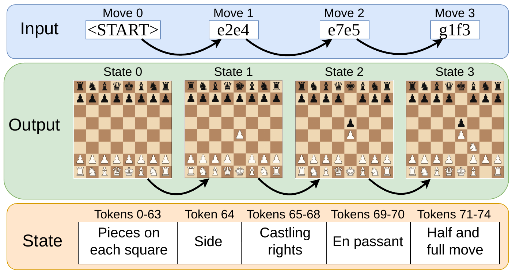

<div align="center">

# Chess-World-Model

### A 10M-game benchmark for exact state tracking from chess move sequences

<p>
  <a href="./Chess_World_Model.pdf"><strong>Paper PDF</strong></a>
  |
  <a href="./figure/ChessDataset.pdf"><strong>Dataset figure</strong></a>
  |
  <a href="https://database.lichess.org/"><strong>Lichess database</strong></a>
  |
  <a href="./LICENSE"><strong>MIT licence</strong></a>
</p>

<p>
  
  
  
  
</p>

</div>

<p align="center">
  
</p>

<p align="center">
  <sub>
    Each input prefix is aligned with the complete chess state reached after that prefix:
    piece placement, side to move, castling rights, en passant state, and move counters.
  </sub>
</p>

## Overview

Chess-World-Model is a benchmark for testing whether sequence models can maintain an exact latent state over long action histories. The task is not to play chess. Given a legal sequence of UCI moves, a model must reconstruct the full chess state after every prefix of the game.

The benchmark is built around real games from the public Lichess open database and an out-of-distribution random-uniform split generated by uniformly sampling legal moves. This separates in-distribution generalisation on human games from rule-consistent state tracking under legal but non-human trajectories.

<table>
  <tr>
    <td width="33%">
      <strong>Exact state tracking</strong><br>
      Predicts 75 categorical state labels at every timestep, including all 64 board squares and FEN-style auxiliary variables.
    </td>
    <td width="33%">
      <strong>Real and random play</strong><br>
      Uses held-out human games plus uniformly random legal self-play to expose shortcuts hidden by familiar chess positions.
    </td>
    <td width="33%">
      <strong>Matched model interface</strong><br>
      Trains Transformer, SLiCE, Mamba-3, and Gated DeltaNet models under a shared move-to-state prediction protocol.
    </td>
  </tr>
</table>

This repository contains the code release: preprocessing, data loading, model definitions, training, experiment presets, and checkpoint evaluation. It does not include processed Lichess data, generated test sets, model checkpoints, or experiment logs.

## Repository Layout

```text
.
|-- main.py                  # training entrypoint
|-- training.py              # training loop, validation, checkpointing
|-- data/                    # PGN processing, JSONL loading, random test generation
|-- evaluation/              # checkpoint evaluation and metrics
|-- models/                  # Transformer, SLiCE, Mamba, Gated DeltaNet
|-- experiment_configs/      # named JSON presets
|-- figure/                  # dataset figure used in the README and paper
|-- Chess_World_Model.pdf    # paper preprint
`-- pyproject.toml           # uv project metadata
```

## Setup

This project uses Python 3.12 and `uv`.

```bash
uv sync
```

The base environment supports the Transformer and SLiCE presets. Gated DeltaNet and Mamba use optional dependency groups described below.

For local smoke tests or runs without Weights & Biases logging, pass:

```bash
--wandb_mode disabled
```

## Data

Processed chess data is intentionally not included. Download PGN exports directly from the Lichess open database:

```text
https://database.lichess.org/
```

Standard rated game files follow this pattern:

```text
https://database.lichess.org/standard/lichess_db_standard_rated_YYYY-MM.pgn.zst
```

The paper uses March 2025 Lichess games as the training/validation source and April 2025 games for the held-out real-game test condition. The commands below use the same months as examples.

### Download and Decompress

```bash
mkdir -p data/raw

curl -L \
  -o data/raw/lichess_db_standard_rated_2025-03.pgn.zst \
  https://database.lichess.org/standard/lichess_db_standard_rated_2025-03.pgn.zst

zstd -d \
  -o data/raw/lichess_db_standard_rated_2025-03.pgn \
  data/raw/lichess_db_standard_rated_2025-03.pgn.zst
```

Lichess files are large. Full monthly standard-rated exports are tens of GB compressed and much larger after decompression. The database page also provides torrent downloads, which are often more reliable for full months.

### Process Real Games

The processor replays each PGN game with `python-chess`, packs each UCI move into a categorical move token, and writes sharded JSONL examples containing aligned `moves` and `states`.

```bash
mkdir -p data/processed/lichess_2025_03

export CHESS_WORLD_MODEL_ID_KEY="$(openssl rand -hex 32)"

uv run python -m data.process \
  --pgn data/raw/lichess_db_standard_rated_2025-03.pgn \
  --out data/processed/lichess_2025_03 \
  --max-games 10000000 \
  --min-fullmoves 10 \
  --shard-size 1000000
```

This writes up to 10M retained games, matching the benchmark scale used in the paper. Omit or change `--max-games` for a different corpus size.

`CHESS_WORLD_MODEL_ID_KEY` is used only to derive stable opaque example IDs from source game URLs. Keep the same value if you want deterministic IDs and train/validation splits across repeated preprocessing runs. Do not commit it.

For a quick local smoke test:

```bash
mkdir -p data/processed_smoke

uv run python -m data.process \
  --pgn data/raw/lichess_db_standard_rated_2025-03.pgn \
  --out data/processed_smoke \
  --max-games 1000 \
  --min-fullmoves 10
```

### Generate Test Sets

Create a local held-out real-game test set from another Lichess month:

```bash
mkdir -p data/test/lichess_april_2025_10k

curl -L \
  -o data/raw/lichess_db_standard_rated_2025-04.pgn.zst \
  https://database.lichess.org/standard/lichess_db_standard_rated_2025-04.pgn.zst

zstd -d \
  -o data/raw/lichess_db_standard_rated_2025-04.pgn \
  data/raw/lichess_db_standard_rated_2025-04.pgn.zst

uv run python -m data.process \
  --pgn data/raw/lichess_db_standard_rated_2025-04.pgn \
  --out data/test/lichess_april_2025_10k \
  --max-games 10000 \
  --min-fullmoves 10
```

Generate a random-uniform legal-play test set:

```bash
mkdir -p data/test/random_uniform_10k

uv run python -m data.generate_random_uniform_test_set \
  --out data/test/random_uniform_10k \
  --games 10000 \
  --seed 0
```

Processed JSONL files, decompressed PGNs, checkpoints, logs, and evaluation outputs are ignored by git.

## Training

Run a small Transformer smoke test:

```bash
uv run python -m main \
  --data_path data/processed_smoke \
  --experiment_config transformer_d128_defaults_simple \
  --epochs 1 \
  --val_every 0 \
  --save_every 0 \
  --wandb_mode disabled
```

Run a preset on the processed training corpus:

```bash
uv run python -m main \
  --data_path data/processed/lichess_2025_03 \
  --experiment_config mamba_d384_defaults_simple \
  --ckpt_path checkpoints/mamba_d384 \
  --wandb_run_name mamba_d384 \
  --wandb_mode disabled
```

`--experiment_config` accepts either a JSON file path or a preset name under `experiment_configs/`, with or without the `.json` suffix. CLI flags override values from the selected config.

## Experiment Presets

<table>
  <tr>
    <th>Family</th>
    <th>Preset names</th>
    <th>Extra dependency group</th>
  </tr>
  <tr>
    <td>Transformer</td>
    <td><code>transformer_d{128,256,384,512}_defaults_simple</code></td>
    <td>base install</td>
  </tr>
  <tr>
    <td>SLiCE</td>
    <td><code>slice_d{128,256,384,512}_defaults_simple</code></td>
    <td>base install</td>
  </tr>
  <tr>
    <td>Gated DeltaNet</td>
    <td><code>gated_deltanet_d{128,256,384,512}_defaults_simple</code></td>
    <td><code>fla</code></td>
  </tr>
  <tr>
    <td>Mamba-3</td>
    <td><code>mamba_d{128,256,384,512}_defaults_simple</code></td>
    <td><code>mamba</code></td>
  </tr>
</table>

The size ladder corresponds to approximately 3M, 8M, 18M, and 38M parameters in the paper configurations.

<details>
<summary><strong>Optional dependency setup</strong></summary>

Gated DeltaNet uses `flash-linear-attention`:

```bash
uv sync --group fla
```

Mamba runs use the optional Mamba dependency group:

```bash
MAMBA_FORCE_BUILD=TRUE \
uv sync --group mamba --refresh-package mamba-ssm --reinstall-package mamba-ssm
```

The repo pins `mamba-ssm` to a Git revision because the tested PyPI release did not expose `mamba_ssm.modules.mamba3`. Verify the install before launching `mamba-3` runs:

```bash
uv run python -c "from mamba_ssm.modules.mamba3 import Mamba3; print(Mamba3.__name__)"
```

If that import still fails, rebuild without using cached wheels:

```bash
MAMBA_FORCE_BUILD=TRUE \
uv pip install --python .venv/bin/python \
  --no-build-isolation \
  --no-deps \
  --force-reinstall \
  --no-cache-dir \
  "mamba-ssm @ git+https://github.com/state-spaces/mamba@b267be48e9e71a3a37310ade04b058625409da2d"
```

</details>

## Learning-Rate Scheduling

Training supports optional per-step scheduling:

```text
lr_scheduler:    none | cosine | linear
lr_warmup_steps: linear warmup steps
lr_decay_steps:  scheduler horizon in optimiser steps
lr_min_ratio:    final LR ratio relative to base LR
```

Example:

```bash
uv run python -m main \
  --data_path data/processed/lichess_2025_03 \
  --experiment_config transformer_d256_defaults_simple \
  --batch_size 128 \
  --lr 3e-4 \
  --lr_scheduler cosine \
  --lr_warmup_steps 5000 \
  --lr_decay_steps 620000 \
  --lr_min_ratio 0.1 \
  --wandb_mode disabled
```

## Evaluation

Evaluate one or more checkpoints against local JSONL test sets:

```bash
uv run python -m evaluation.evaluate_on_test_sets \
  --checkpoint checkpoints/mamba_d384/latest.pt \
  --dataset lichess_april_2025_10k=data/test/lichess_april_2025_10k \
  --dataset random_uniform_10k=data/test/random_uniform_10k
```

The evaluator accepts checkpoint files or checkpoint directories containing `latest.pt`. Results are written under `test_eval/` by default, with one JSON file per checkpoint and a combined `summary.tsv`.

Useful evaluation flags:

```text
--cpu             force CPU evaluation
--output_root     choose the output directory
--max_batches     cap batches per dataset for a quick check
--batch_size      override the checkpoint batch size
```

## Paper

The accompanying preprint is included as [`Chess_World_Model.pdf`](./Chess_World_Model.pdf).

```bibtex
@misc{walker2026chessworldmodel,
  title  = {Chess-World-Model: A 10M-Game Benchmark for Exact State Tracking from Chess Move Sequences},
  author = {Walker, Benjamin and Lyons, Terry},
  year   = {2026}
}
```

## Licence

This code is released under the [MIT licence](./LICENSE). Lichess database exports are distributed separately by Lichess under CC0.
